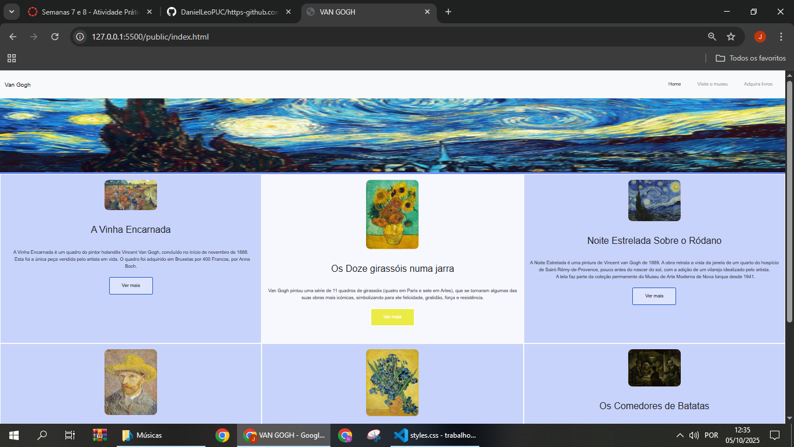
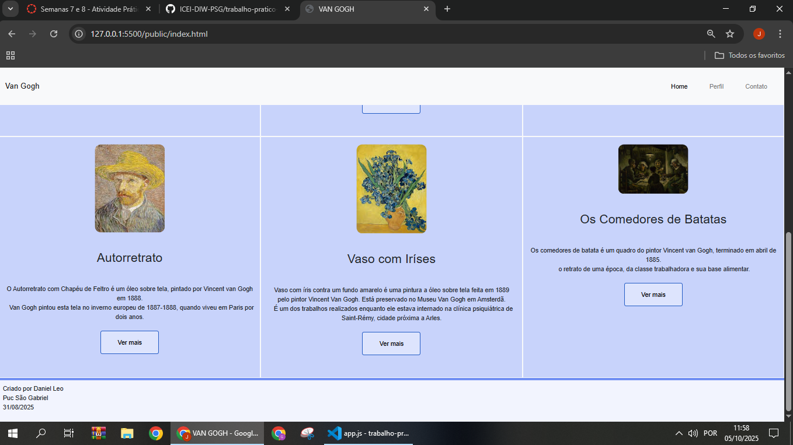
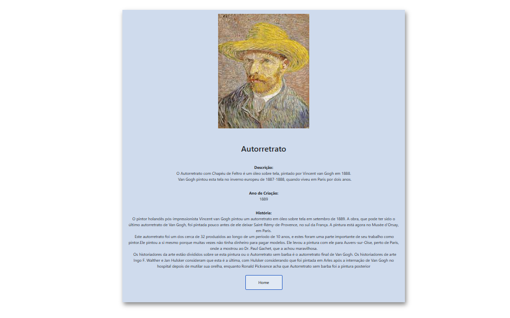

**Páginas de detalhes dinâmicas**

Nessa etapa, vamos evoluir o trabalho anterior, acrescentando a página de detalhes, conforme o  projeto escolhido. Imagine que a página principal (home-page) mostre um visão dos vários itens que existem no seu site. Ao clicar em um item, você é direcionado pra a página de detalhes. A página de detalhe vai mostrar todas as informações sobre o item do seu projeto. seja esse item uma notícia, filme, receita, lugar turístico ou evento.

Leia o enunciado completo no Canvas. 

**IMPORTANTE:** Assim como informado anteriormente, capriche na etapa pois você vai precisar dessa parte para as próximas semanas. 

**IMPORTANTE:** Você deve trabalhar e alterar apenas arquivos dentro da pasta **`public`,** mantendo os arquivos **`index.html`**, **`styles.css`** e **`app.js`** com estes nomes, conforme enunciado. Deixe todos os demais arquivos e pastas desse repositório inalterados. **PRESTE MUITA ATENÇÃO NISSO.**

## Informações Gerais

- Nome: Daniel Junio Leo
- Matricula: 900673
- Proposta de projeto escolhida: Proposta de projeto escolhida: Proposta 4-Coleções e Itens.
- Breve descrição sobre seu projeto: Estou Elaborando  um site que fornece informações sobre as obras de arte do artista Vincent van Gogh. Nessa etapa do Projeto, houve a criação do conteúdo da Home Page e detalhes de forma dinâmica utilizando do JavaScript(JSON e Query string).

## Print da Home-Page




## Print da página de detalhes do item



## Cole aqui abaixo a estrutura JSON utilizada no app.js

```javascript

const obras = [
    { "id": 0, "imagem": "img/avinha.jpg", "titulo": "A Vinha Encarnada","data": "1888", "descricao": " A Vinha Encarnada é um quadro do pintor holandês Vincent Van Gogh, concluído no início de novembro de 1888.<br>&nbsp; Esta foi a única peça vendida pelo artista em vida. O quadro foi adquirido em Bruxelas por 400 Francos, por Anna Boch.", "descricaoCompleta":"O quadro do pintor holandês Vincent Van Gogh, concluído no início de novembro de 1888. Esta foi a única peça vendida pelo artista em vida.<br>&nbspO quadro foi adquirido em Bruxelas por 400 Francos, por Anna Boch. Van Gogh ficou sabendo do negócio por intermédio de seu irmão e mecenas Theo Van Gogh, em fevereiro de 1890.<br>&nbsp A Vinha Encarnada foi exibida pela primeira vez na mostra de Les XX, em 1890, em Bruxelas e vendida por 400 Francos belgas  para Anna Boch, uma pintora impressionista da Bélgica, membra do Les XX e colecionadora de arte. Anna era irmã de Eugène Boch, também pintor impressionista e amigo de Van Gogh, que havia pintado o retrato de Boch  em Arles, no outono de 1888.<br>&nbsp Assim como o Terraço do Café à Noite, foi adquirida pelo colecionador russo Sergei Shchukin. Veio a ser nacionalizada pelos bolcheviques junto com o resto da coleção de Sergei, a qual, eventualmente, foi para o Museu Pushkin de Belas Artes em Moscou." },

    { "id": 1, "imagem": "img/giracois.jpg", "titulo": "Os Doze girassóis numa jarra","data": "1888", "descricao": "Van Gogh pintou uma série de 11 quadros de girassóis (quatro em Paris e sete em Arles), que se tornaram algumas das suas obras mais icónicas, simbolizando para ele felicidade, gratidão, força e resistência." , "descricaoCompleta" : "Os Doze girassóis numa jarra é uma pintura do pintor holandês Vincent van Gogh. Após a chegada do pintor ao sul da França, estabelecendo-se em Arles, Van Gogh passou a utilizar efeitos de cores e de luz com mais intensidade. Doze Girassóis numa Jarra pode ser considerado o culminar de todo este efeito em na obra do artista.<br>&nbsp Finalizado em agosto de 1888, o quadro está hoje exposto na Neue Pinakothek, em Munique.<br>&nbsp  Atualmente, esta é uma das telas mais famosas do mundo. Tal sucesso e reconhecimento contrastam com a vida do seu autor, que sempre viveu à margem da sociedade. Ao longo de toda a trajetória de Van Gogh, o artista vendeu somente um quadro. Ele só foi reconhecido mundialmente depois de sua morte." },

    { "id": 2, "imagem": "img/noiteestrelada.jpg", "titulo": "Noite Estrelada Sobre o Ródano","data": "1889", "descricao": "  A Noite Estrelada é uma pintura de Vincent van Gogh de 1889. A obra retrata a vista da janela de um quarto do hospício de Saint-Rémy-de-Provence, pouco antes do nascer do sol, com a adição de um vilarejo idealizado pelo artista.<br>&nbsp; A tela faz parte da coleção permanente do Museu de Arte Moderna de Nova Iorque desde 1941.", "descricaoCompleta" : " Noite Estrelada Sobre o Ródano é uma pintura de 1888 do pintor holandês Vincent van Gogh.O quadro foi pintado após a sua mudança para Arles, no sul da França, nove meses antes de ser hospitalizado e dois anos antes de cometer suicídio. Em Arles, Van Gogh produziu outras obras famosas, como Quarto em Arles e Terraço do Café à Noite.<br>&nbsp;Atualmente a obra está exposta no Musée d'Orsay, em Paris, França. Ela foi exposta pela primeira vez em 1889 Salon des Artistes Independants.<br>&nbsp;A obra retrata a paisagem vista à noite à beira do Ródano, um importante rio europeu." },

    { "id": 3, "imagem": "img/autoretrato.jpg", "titulo": "Autorretrato","data": "1889", "descricao": " O Autorretrato com Chapéu de Feltro é um óleo sobre tela, pintado por Vincent van Gogh em 1888.<br>&nbsp; Van Gogh pintou esta tela no inverno europeu de 1887-1888, quando viveu em Paris por dois anos.", "descricaoCompleta" : "O pintor holandês pós-impressionista Vincent van Gogh pintou um autorretrato em óleo sobre tela em setembro de 1889. A obra, que pode ter sido o último autorretrato de Van Gogh, foi pintada pouco antes de ele deixar Saint-Rémy-de-Provence, no sul da França. A pintura está agora no Musée d'Orsay, em Paris.<br>&nbsp;Este autorretrato foi um dos cerca de 32 produzidos ao longo de um período de 10 anos, e estes foram uma parte importante de seu trabalho como pintor.Ele pintou a si mesmo porque muitas vezes não tinha dinheiro para pagar modelos. Ele levou a pintura com ele para Auvers-sur-Oise, perto de Paris, onde a mostrou ao Dr. Paul Gachet, que a achou maravilhosa.<br>&nbsp; Os historiadores da arte estão divididos sobre se esta pintura ou o Autorretrato sem barba é o autorretrato final de Van Gogh. Os historiadores de arte Ingo F. Walther e Jan Hulsker consideram que esta é a última, com Hulsker considerando que foi pintada em Arles após a internação de Van Gogh no hospital depois de mutilar sua orelha, enquanto Ronald Pickvance acha que Autorretrato sem barba foi a pintura posterior" },

    { "id": 4, "imagem": "img/vaso.jpg", "titulo": "Vaso com Iríses","data": "1890 ", "descricao": "Vaso com íris contra um fundo amarelo é uma pintura a óleo sobre tela feita em 1889 pelo pintor Vincent Van Gogh. Está preservado no Museu Van Gogh em Amsterdã.<br> &nbsp; É um dos trabalhos realizados enquanto ele estava internado na clínica psiquiátrica de Saint-Rémy, cidade próxima a Arles." , "descricaoCompleta" : "Vaso com Íris Contra um Fundo Amarelo é uma pintura a óleo sobre tela feita em 1889 pelo pintor Vincent Van Gogh . Está preservada no Museu Van Gogh em Amsterdã . É uma das obras feitas enquanto ele estava internado na clínica psiquiátrica de Saint-Rémy, uma cidade perto de Arles. A obra está localizada no museu Van Gogh em Amsterdã.<br>&nbsp;Van Gogh tem uma obra semelhante, com o mesmo nome, mas também conhecida como Vaso com Íris , localizada no Metropolitan Museum of Art, em Nova York .<br>&nbsp;A pintura criada em  1890 pertence a série de pinturas sobre flores ( Vaso com Centáureas e Papoulas , Vaso com Rosas Cor-de-Rosa , Vaso Japonês com Rosas e Anêmonas ) pode-se perceber a influência das gravuras japonesas , tema que o fascinou durante a maior parte de sua trajetória artística e que foi muito popular entre a sociedade de sua época, o que o levou a eliminar as sombras e ocupar grande parte da pintura com flores densas e seus caules grossos. "},

    { "id": 5, "imagem": "img/oscomedores.jpg", "titulo": "Os Comedores de Batatas","data": "1885", "descricao": " Os comedores de batata é um quadro do pintor Vincent van Gogh, terminado em abril de 1885.<br>&nbsp;o retrato de uma época, da classe trabalhadora e sua base alimentar.","descricaoCompleta":"Os Comedores de Batatas é uma pintura a óleo sobre tela feita em 1885 pelo pintor holandês Vincent van Gogh. A obra está localizada no Museu Van Gogh em Amsterdã. A pintura retrata uma família de camponeses comendo batatas, e é considerada uma das obras mais importantes do período inicial de Van Gogh na Holanda. A obra foi inspirada por um esboço feito por Van Gogh em 1883, durante sua estadia em Nuenen, onde ele morava com seus pais e trabalhava como pastor.<br>&nbsp;Van Gogh queria mostrar a vida difícil dos camponeses e a importância da batata como alimento básico para eles. Ele usou cores escuras e tons terrosos para criar uma atmosfera sombria e realista, enfatizando a dureza da vida rural. A pintura foi criticada na época por sua representação crua e não idealizada dos camponeses, mas hoje é considerada uma obra-prima do pós-impressionismo e um exemplo do compromisso social de Van Gogh." }
+
];
```